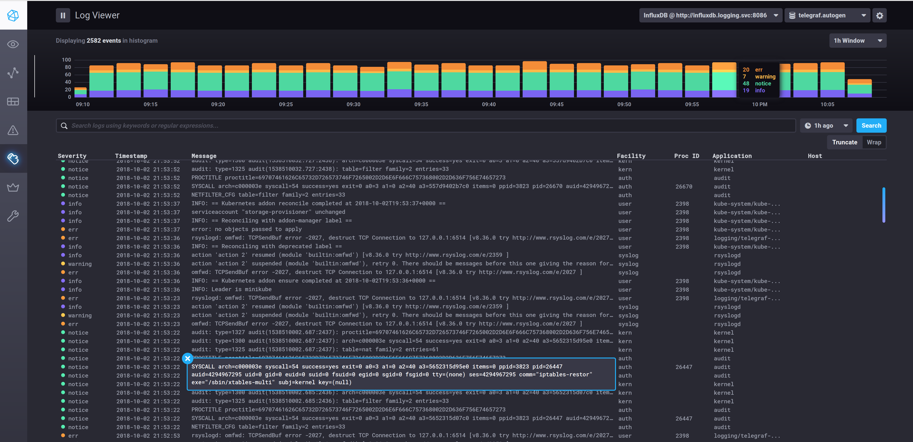
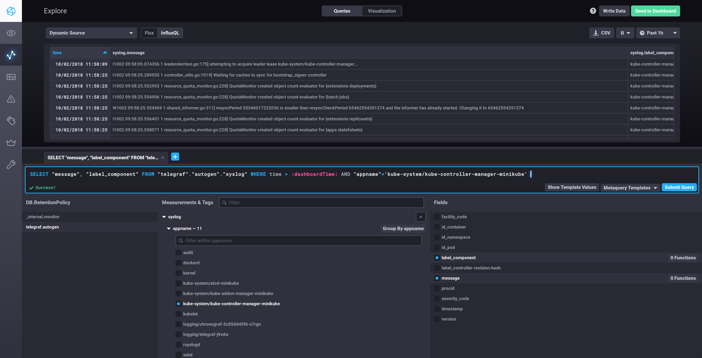
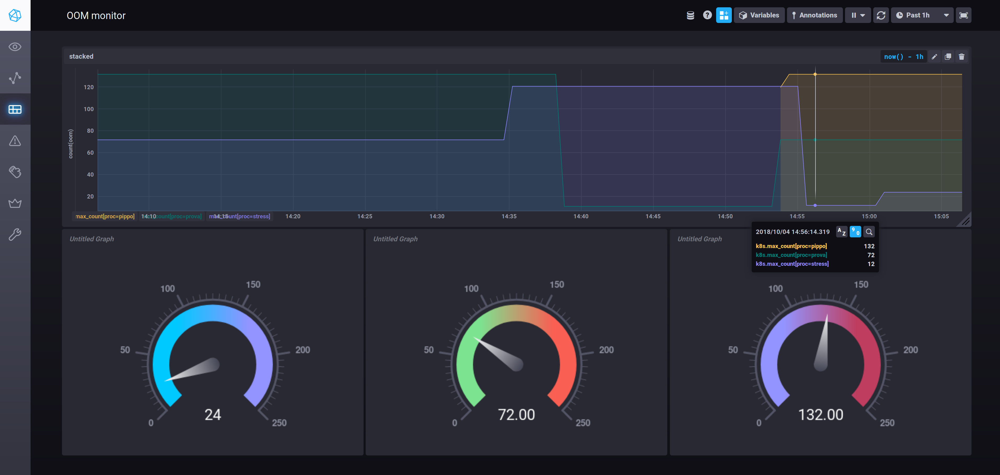
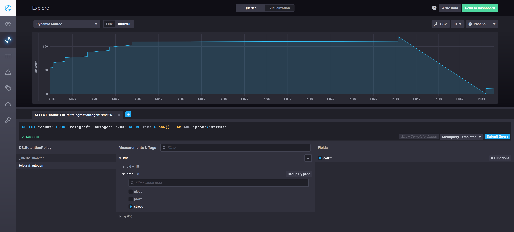
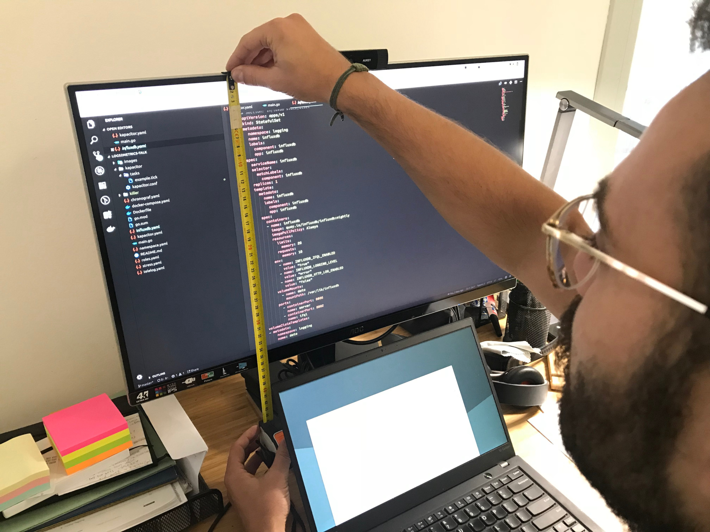
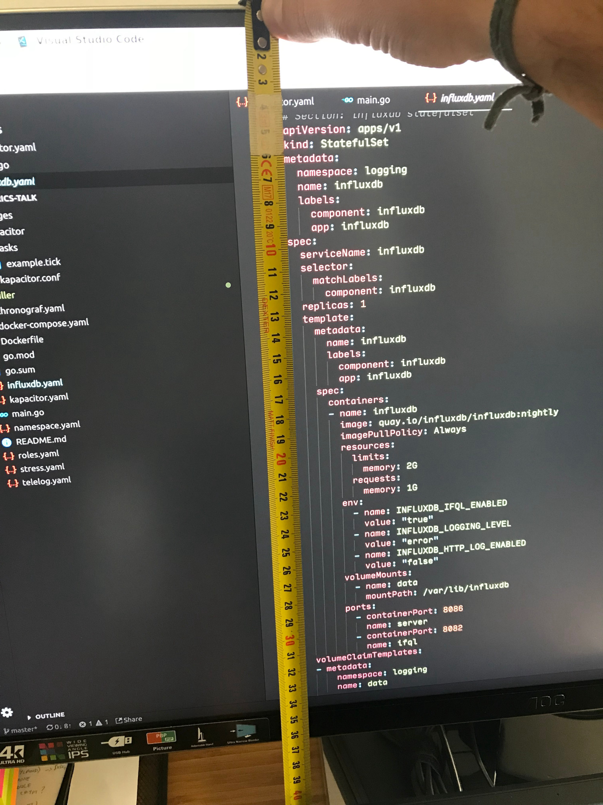

# Talk: From logs to metric with the TICK stack

[**Slides**](http://bit.ly/from-logs-to-metrics-tick).

This repository contains the PoC associated with the talk "From logs to metric with the TICK stack".

Its main goal is to show how to extract (structured) value from the huge amount of (unstructured) information that logs contain.

In brief, the steps are as follows: parsing of syslog messages into structured data, ingesting/collecting them via Telegraf syslog input plugin, visualizing and plot them via Chronograf's log viewer, and eliciting new meaningful metrics (eg. number of process OOM killed) to plot processing them via a Kapacitor [UDF](https://docs.influxdata.com/kapacitor/v1.5/guides/socket_udf/).

The stack used to achieve this is:

- [Telegraf](https://github.com/influxdata/telegraf) with [syslog input plugin](https://github.com/influxdata/telegraf/tree/master/plugins/inputs/syslog), which uses this blazing fast [go-syslog](https://github.com/influxdata/go-syslog) parser
- Chronograf
- InfluxDB
- [Kapacitor](https://github.com/influxdata/kapacitor)









## Setup

First of all we need a local k8s environment.

Let's proceed with minikube.

```bash
minikube start --docker-opt log-driver=journald
```

Note that we need the **journald log driver** for the inner docker since the rsyslog's mmkubernetes module [only works with it](https://www.rsyslog.com/doc/master/configuration/modules/mmkubernetes.html) (or with **json-file docker log driver**).

The following step is to become a YAML developer :hear_no_evil: :speak_no_evil:, applying all the YAML files describing our setup.

|  |  |
|:---:|:---:|

Assuming your minikube setup is capable of provisioning volumes, execute the following commands.

```bash
kubectl apply -f namespace.yaml
kubectl apply -f roles.yaml
kubectl apply -f influxdb.yaml
kubectl apply -f telelog.yaml
kubectl apply -f chronograf.yaml
kubectl apply -f kapacitor.yaml
kubectl apply -f stress.yaml
```

Finally to access Chronograf from within our local browser we need the following port forward.

```bash
kubectl port-forward svc/chronograf -n logging 8888:80
```

Go to [localhost:8888](http://localhost:8888) now!

## Run with local up cluster

_TBD_.

## Developing the Kapacitor UDF

File `docker-compose.yaml` is useful during the development and debugging of the Kapacitor UDF.

To make it working do not forget to forward the port of the influxdb within minikube.

```bash
kubectl port-forward svc/influxdb -n logging 8686:8686
```

Then run

```bash
docker-compose up -d
```

## Other suitable docker log drivers

It is possible to use this with **[syslog docker log driver](https://docs.docker.com/config/containers/logging/syslog/#options)** with following log options:

- `syslog-format=rfc5424micro`
- `syslog-address=udp://1.2.3.4:1111` (telegraf syslog plugin)

In such case:

- there is not need for rsyslog
- telegraf syslog plugin in UDF mode (at the moment in TCP/TLS mode there is not way to disable octet framing requirement - ie., RFC5425)
- syslog facility will be fixed (depending on the `syslog-facility` option)

_TBD_: create an alternative setup for this setup.

---

[](https://github.com/igrigorik/ga-beacon)
